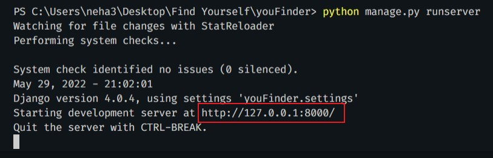
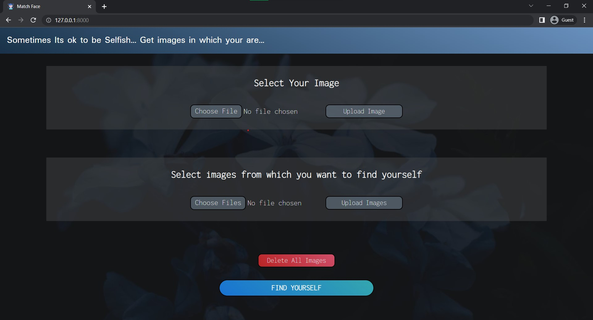
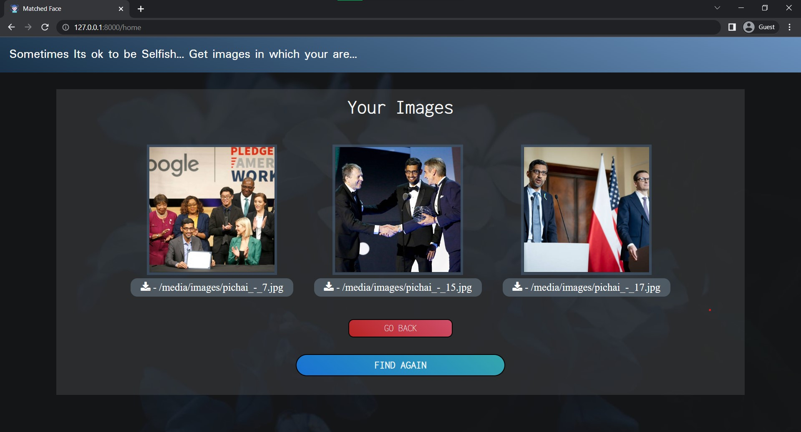

<h1 align='center'>YouFinder</h1>

## About the Website

- <b>'YouFinder'</b>  is a web application based on facial recognition technology for all the lazy peeps like me who does not want to scroll through their whole gallery to find all the photos in which they are present. Here in this website, you just have to upload your single image and all the other images from which you want to find yourself and the application will display all your photos having an option to download it. 

- <b>Languages and Technologies used : </b> Python, HTML & CSS
- Django web framework was used for the development of the whole web app. OpenCv and face_recognition API's were used for the development of Face Recognizer. 


**Note: Python version 3.10.4 was used for this project.**


## Requirements to run the website
Requirement 1: 

Install python version>=3.7

**Now run the following commands:**

Requirement 2: 
```python
pip install --upgrade pip
``` 
Requirement 3: 
```python
pip install cmake 
```
Requirement 4: 
```python
pip install dlib
``` 
(if any error in installing dlib then try this) 

Check Python Version Type in cmd
```python
python --version
```
And then

For Python 3.7..
```python
pip install https://github.com/Murtaza-Saeed/dlib/raw/master/dlib-19.19.0-cp37-cp37m-win_amd64.whl
```

For Python 3.8..
```python
pip install https://github.com/Murtaza-Saeed/dlib/raw/master/dlib-19.19.0-cp38-cp38-win_amd64.whl
```
For Python 3.9..
```python
pip install https://github.com/Murtaza-Saeed/dlib/raw/master/dlib-19.22.1-cp39-cp39-win_amd64.whl
```
For Python 3.10..
```python
pip install https://github.com/Murtaza-Saeed/dlib/raw/master/dlib-19.22.99-cp310-cp310-win_amd64.whl
```
Requirement 5: 
```python
pip install face_recognition
```
Requirement 6: 
```python
pip install opencv-python
```
Requirement 7: 
```python
pip install django
```

**To run the web app on your local computer, clone this repository, open the terminal in the same directory and run the following command :**
```python
python manage.py runserver
```
Open your favorite browser. I recommend using Google Chrome or Brave and open the following url:




## Screenshots
<h3 align='center'>Home Page</h3>


<h3 align='center'>Choose your image</h3>


<h3 align='center'>Select all other images</h3>


<h3 align='center'>Your all images are displayed</h3>


